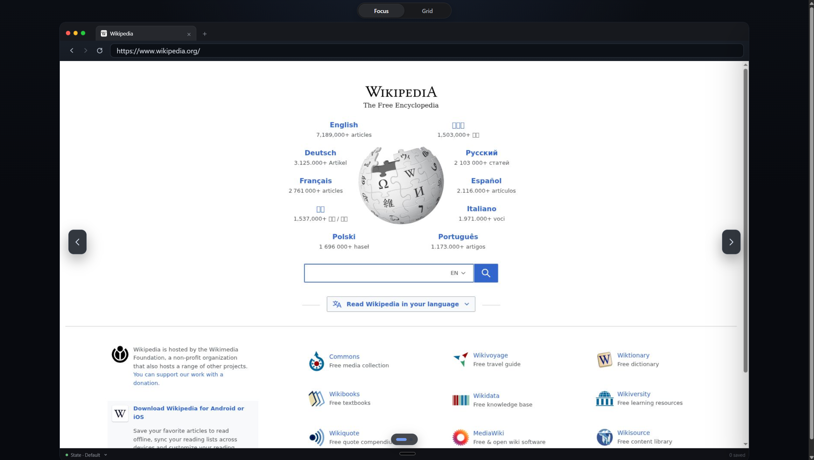
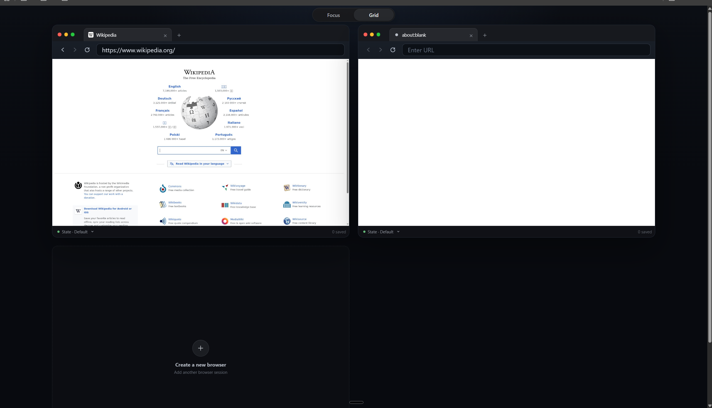

# Browserplane

Mirrors a real Chromium tab into a web page. The backend drives the tab over the
Chrome DevTools Protocol and replays viewer input; the browser worker streams
JPEG frames through the backend to a `<canvas>`.

Learning project: no auth, no rate limiting.

- [See it in action](#see-it-in-action)
- [Architecture](#architecture)
- [Deep dives](#deep-dives)
- [Setup](#setup)
- [Development](#development)
- [HTTP API](#http-api)
- [Browser tunnel](#browser-tunnel)
- [Configuration](#configuration)

## See it in action

A leased session — tab strip, address bar, and state toolbar:



The gallery — several leased browsers side by side:



Real Chromium tabs on the server, not iframes: clipboard round-tripped through
CDP, tabs in sync with the mirrored session, and cursor shape translated from
CDP into a CSS cursor in the frontend (it is not part of the frame stream).

## Architecture

```text
┌─────────────┐   HTTP + WS (JSON-RPC)   ┌───────────────────────────────┐
│  Frontend   │ ───────────────────────▶ │  Backend · API                │
│ Angular SPA │ ◀─────────────────────── │  gateway (JSON-RPC ⇄ CDP)     │
│  <canvas>   │   JPEG frames, events    │  sessions · requests · leases │
└─────────────┘                          └──────┬─────────────────┬──────┘
                                                │ SQL             │ CDP · WS
┌─────────────────────────────┐                 ▼                 │
│  Scheduler                  │        ┌───────────────────┐      │
│  request dispatcher         │──SQL──▶│     Postgres      │      │
│  lease reaper               │        │  source of truth  │      │
│  slot reconciliation        │        │  slots · leases   │      │
│  leader-elected             │        │  sessions · state │      │
└──────┬──────────────────────┘        └───────────────────┘      │
       │ internal HTTP: start · release · state                   │
       ▼                                                          ▼
┌──────────────────────────────────────────────────────────────────────┐
│  Browser worker × 2 — one Chromium each                              │
│  lifecycle · CDP · screencast · downloads · recordings · state       │
└───────────────────────────────┬──────────────────────────────────────┘
                                ▼
                          ┌──────────┐
                          │ Chromium │
                          └──────────┘
```

| Component | Path | Owns |
| --- | --- | --- |
| Frontend | `frontend/` | `<canvas>`; replays DOM events as CDP commands, talks only to the backend |
| Gateway | `backend/…/features/browser_tunnel/` | JSON-RPC 2.0 ⇄ CDP, frame relay; keeps worker and CDP addresses off the wire |
| API | `backend/…/features/` | sessions, session requests, leases, browsers, recordings, health |
| Scheduler | `backend/src/backend/scheduler.py` | dispatches queued requests, reaps leases, reconciles slots |
| Browser worker | `browser_worker/` | one Chromium each: lifecycle, CDP, screencast, downloads, recordings, state |

**Control plane / data plane.** The control plane decides who may use which
browser until when — its truth is a Postgres row, and it survives a crash. The
data plane *is* the browser — its truth is a running process, and it is thrown
away. A `READY` row does not prove a clean Chromium, and a live Chromium
entitles nobody to use it: only a proven cleanup plus a fresh runtime returns a
slot to the pool. Leases end on deadlines, never on a dropped socket.

Live traffic uses two transports: the backend WebSocket for JSON-RPC and
tab/navigation/cursor state, a browser worker WebSocket for binary JPEG frames.

## Deep dives

| Document | Question it answers |
| --- | --- |
| [docs/planes.md](docs/planes.md) | Who owns which truth, and which process may do what |
| [docs/browser-lifecycle.md](docs/browser-lifecycle.md) | Slot vs. runtime vs. lease, and how fencing keeps them honest |
| [docs/acquiring-a-browser.md](docs/acquiring-a-browser.md) | What happens when the pool is full and a caller waits |
| [docs/session-state.md](docs/session-state.md) | Why authentication and browser state are two documents |

Working specs: `LEASE_CONCEPT.md`, `REQUEST_CONCEPT.md`.

## Setup

```bash
uv sync
(cd frontend && npm install)
uv run pre-commit install
```

## Development

```bash
docker compose up --build     # Postgres, MinIO, migrations, backend, scheduler, workers
(cd frontend && npm run dev)  # regenerates every client, then serves on :5173
```

That is the whole loop. `npm run dev` runs `predev`, which exports the OpenAPI
and OpenRPC documents and rewrites all three generated clients — none of them is
written by hand: `frontend/generated` (browser JSON-RPC, from OpenRPC),
`frontend/generated-backend` (backend HTTP, via [orval](https://orval.dev)), and
the uv workspace package `generated/` (Python worker client, via httpxgen).

The rest is only needed on its own:

```bash
(cd frontend && npm run generate)         # all clients, without serving
(cd frontend && npm run check:generated)  # fail if any client is stale
(cd backend && uv run alembic revision --autogenerate -m "...")
(cd backend && uv run alembic upgrade head)

uv run pytest        # tests
uv run ruff check .  # lint
uv run ruff format . # format
(cd frontend && npm run build) # type-check and build
```

Keep awaited application or repository calls separate from response mapping so
both steps remain easy to read:

```python
request = await control.get(request_id, owner_id)
return SessionRequestResponse.model_validate(request)
```

Smoke test: `uv run python backend/tests/browser_tunnel/manual_smoke.py`.

## HTTP API

| Method | Path | Purpose |
| --- | --- | --- |
| `POST` | `/api/v1/sessions` | open a session; waits for capacity until its deadline |
| `GET` `DELETE` | `/api/v1/session-requests/{id}` | inspect or cancel a wait |
| `GET` `DELETE` | `/api/v1/sessions/{id}` | inspect or close a session |
| `POST` | `/api/v1/sessions/{id}/lease/renew` | heartbeat without a tunnel |
| `POST` | `/api/v1/sessions/{id}/suspend` · `/resume` | park a session, pick it up on any free slot |
| `GET` `PUT` | `/api/v1/sessions/{id}/browser-state` | capture or mount tabs, scroll, sessionStorage |
| `PUT` | `/api/v1/sessions/{id}/authentication-profile` | mount a login identity into a live session |
| `POST` | `/api/v1/sessions/{id}/authentication-profiles` | capture the identity as a reusable profile |
| `POST` | `/api/v1/sessions/{id}/browser-checkpoints` | capture the current tabs as a checkpoint |
| `GET` | `/api/v1/sessions/{id}/downloads` · `/{id}/file` | list and fetch what the browser downloaded |
| `POST` `GET` | `/api/v1/browser/{browser_id}/recordings` | start, inspect and stop a recording |
| `GET` | `/api/v1/admin/browsers` · `/admin/sessions` | pool and session overview |
| `GET` | `/api/v1/health` · `/api/v1/readiness` | liveness and readiness |

Full contract: `schemas/backend-openapi.json`, or Swagger UI on
`http://localhost:8000/docs`.

Session state is two independent documents — `authentication_state` (cookies,
origin-localStorage, and IndexedDB; a reusable, encrypted profile) and `browser_state` (tabs,
active tab, scroll, sessionStorage; a checkpoint). Authentication is mounted
first, so restored tabs navigate logged in. See
[docs/session-state.md](docs/session-state.md).

## Browser tunnel

```text
ws /api/v1/sessions/{session_id}/tunnel      JSON-RPC 2.0, relayed to CDP
ws /api/v1/browser/{browser_id}/screencast   binary JPEG frames from the worker
```

```json
{
  "jsonrpc": "2.0",
  "id": 1,
  "method": "browser.nav.navigate",
  "params": { "url": "https://example.com" }
}
```

| Group | Methods |
| --- | --- |
| Navigation | navigate, back, forward, reload (optional cache bypass), stop |
| Mouse | down, move, up — button, modifier, click-count tracking — and scroll |
| Keyboard | key down/up, raw key down, char, text insertion, paste |
| Clipboard | copy, read, write |
| Tabs | list, create, activate, close; every reply carries the full tab list |
| Pushed | tab list, navigation state, cursor style, target crashed/detached |

Server-pushed events arrive as `browser.event`; `params.type` tells frames apart
from tab/navigation state and crashed/detached targets. The OpenRPC contract in
`schemas/openrpc.json` generates the browser client the frontend uses.

## Configuration

```text
BACKEND_BROWSER_WIDTH / _HEIGHT              the mirrored viewport
BACKEND_LEASE_*                              heartbeat 10s, TTL 30s, grace 45s
BACKEND_BROWSER_WORKER_{1,2}_URL             internal worker addresses only
BACKEND_AUTHENTICATION_STATE_ENCRYPTION_KEY  scripts/generate_fernet_key.sh
BROWSER_WORKER_EXECUTABLE / _HEADLESS / _CAPACITY / _STARTUP_TIMEOUT
STORAGE_BUCKET / _ENDPOINT / _REGION / _PREFIX / _ACCESS_KEY / _SECRET_KEY
```

Completed recordings are streamed from the worker into the `recordings/` prefix
of the S3-compatible `browser-recordings` bucket; leaving `STORAGE_BUCKET`
unset drains recordings into a no-op store instead. The transfer runs through
[obstore](https://github.com/developmentseed/obstore), which streams the body
and switches to a multipart upload on its own. MinIO serves S3 on
`http://localhost:9000` and its console on `http://localhost:9001`; credentials
default to `minioadmin` / `minioadmin` and are overridden with
`MINIO_ROOT_USER`, `MINIO_ROOT_PASSWORD`, `MINIO_RECORDINGS_BUCKET`.
